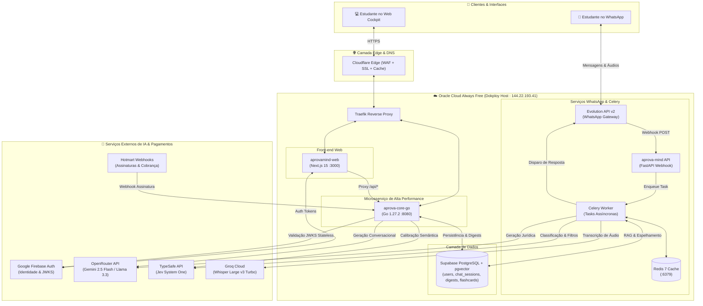
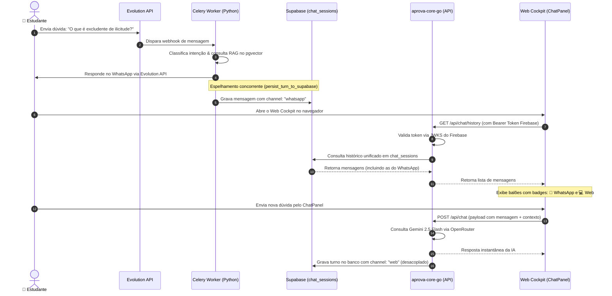
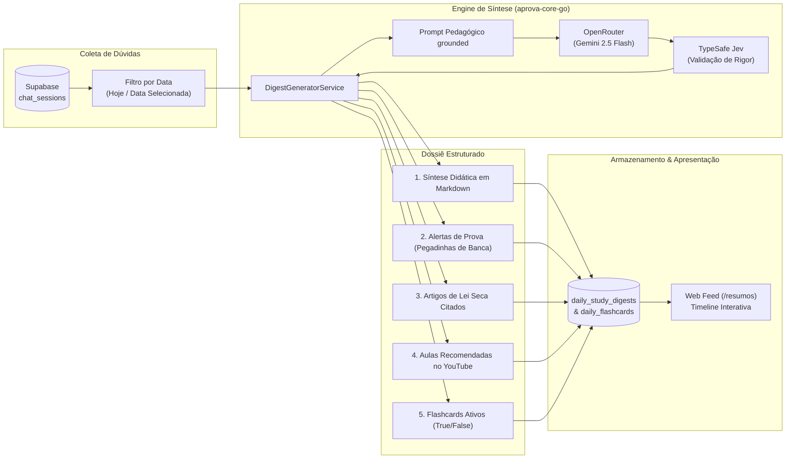
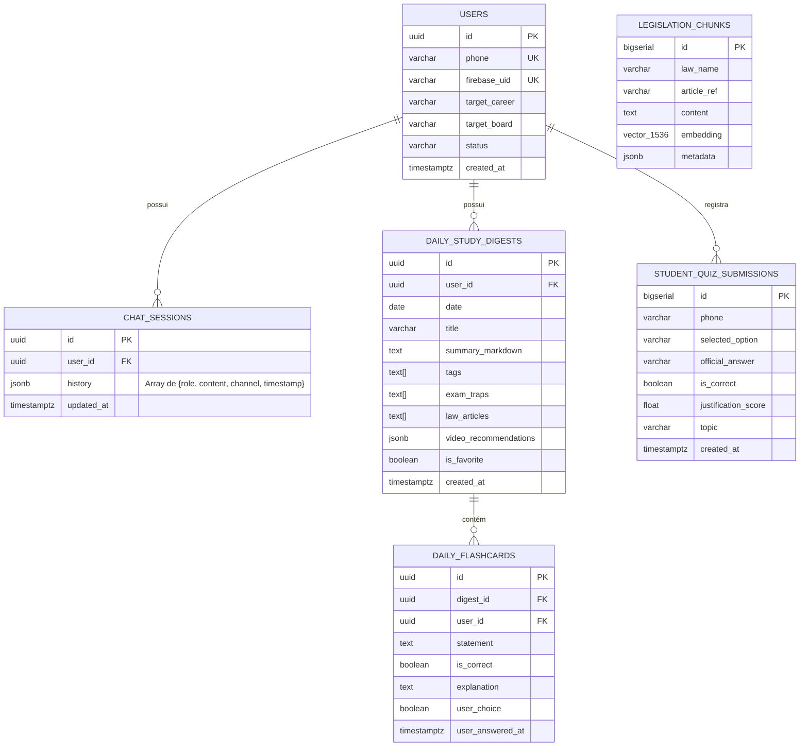
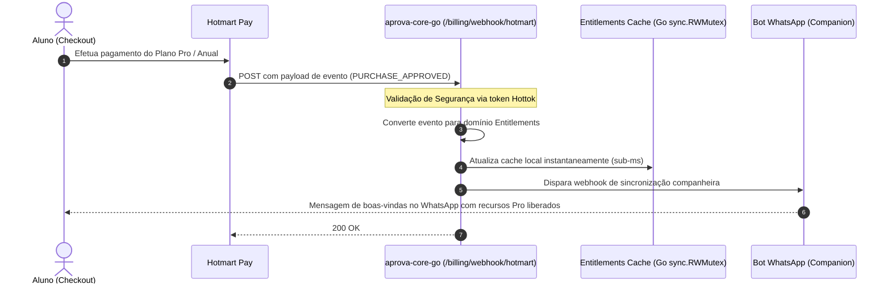

# 🏛️ AprovaMind — Arquitetura Global do Ecossistema

> **Documento Oficial de Engenharia & Arquitetura**  
> **Última Atualização:** Outubro de 2026  
> **Versão do Sistema:** `v2.0-omnichannel`  
> **Status:** 🟢 Produção Ativa (Oracle Cloud Always Free + Cloudflare Edge)  
> **Público-Alvo:** Engenheiros de Software, Arquitetos e Agentes de IA Autônomos.

---

## 1. Visão Geral Executiva

O **AprovaMind** é um ecossistema inteligente de alta performance projetado para preparação acelerada em concursos públicos jurídicos de elite (Magistratura, Ministério Público, Defensoria Pública, Delegado de Polícia e Procuradorias).

### 🎯 Princípios Norteadores da Arquitetura
1. **Experiência Omnicanal Fluida**: O estudante pode tirar dúvidas rápidas por áudio/texto no WhatsApp enquanto está na rua; ao sentar no computador, o histórico completo está visível no painel Web com os canais identificados (`📱 WhatsApp` e `💻 Web`).
2. **Fechamento do Dia & Active Recall**: Ao final do dia, a IA sintetiza tudo o que foi debatido, gera alertas de pegadinhas de bancas examinadoras (Caderno de Erros), mapeia artigos de lei seca, recomenda vídeos do YouTube e cria Flashcards de fixação ativa (Verdadeiro ou Falso).
3. **Custo Operacional R$ 0,00 (Oracle Always Free)**: Infraestrutura auto-hospedada em VPS ARM64 (Ampere A1), gerenciada pelo Dokploy, com microsserviços ultraleves em **Go 1.27.2** e **Alpine Linux** (~15 MB de RAM).
4. **Semântica Rigorosa Anti-Alucinação**: Combinação de RAG com busca vetorial (`pgvector`), modelos de raciocínio profundo via OpenRouter (Gemini 2.5 Flash / Llama 3.3 70B) e julgamentos de bom senso programável com **TypeSafe Jev (System One)**.

---

## 2. Inventário de Repositórios e Serviços

| Repositório / Serviço | Stack Principal | Função no Ecossistema | Domínio / Porta |
|---|---|---|---|
| **`aprova-flow`** | Next.js 15, React 19, Tailwind, Firebase Auth | Cockpit Web do Estudante, cronômetro líquido, dashboard de métricas, timeline de resumos e chat web. | `https://www.aprovamind.com.br` |
| **`aprova-core-go`** | Go 1.27.2, Chi Router, OpenRouter, TypeSafe | Microsserviço central de regras de negócio, checagem de entitlements, chat omnicanal, webhooks Hotmart e gerador de digests. | `https://core.aprovamind.com.br` (Porta 8080) |
| **`aprova-mind`** | Python 3.12, FastAPI, Celery, Redis, Whisper | Gateway de WhatsApp, transcrição de áudio via Groq Whisper, classificação de intenções e RAG jurídico. | Container interno (Celery Worker + Webhook) |
| **`Evolution API v2`** | Node.js, Baileys | Gateway de integração direta com a rede do WhatsApp via QR Code / eSIM. | Container Dokploy interno (:8080) |
| **`Supabase (Self-Hosted)`** | PostgreSQL 15, `pgvector`, PostgREST | Banco relacional e vetorial para legislação, usuários, sessões de chat e flashcards. | `supabase-3e57-db` (Porta 5432 / 8000) |
| **`Dokploy + Traefik`** | Docker, Traefik, Dokploy | Orquestrador de contêineres, SSL automático e CI/CD via webhooks. | IP VPS: `144.22.193.41` |

---

## 3. Topologia Global do Ecossistema



---

## 4. Fluxo Omnicanal de Conversa (WhatsApp ➔ Web)

O estudante pode interagir alternadamente pelo celular ou pelo computador. O histórico é rigorosamente unificado na tabela `chat_sessions` do Supabase.



---

## 5. Fechamento do Dia & Flashcards Interativos

O Fechamento do Dia consolida as interações diárias em uma timeline de estudo ativa.



### Regras do Fechamento do Dia:
1. **Caderno de Erros Inteligente**: Se a dúvida envolvia uma distinção perigosa (ex: *estado de necessidade justificante vs exculpante*), a IA rotula com `Alertas de Prova`.
2. **Lei Seca Mapeada**: Todos os artigos debatidos (ex: *CP, art. 23, 24, 25*) são listados diretamente.
3. **Flashcards de Active Recall**: Cada dúvida dá origem a 3 ou 4 afirmações de Verdadeiro ou Falso. O aluno pode testar seus conhecimentos clicando diretamente no card na Web para validar seu aprendizado.
4. **Favoritos**: O estudante pode marcar com estrela os dias mais importantes para revisar nas vésperas da prova.

---

## 6. Modelo de Dados Unificado (Supabase PostgreSQL)



---

## 7. Fluxo de Assinaturas e Entitlements (Hotmart ➔ Go Core)



---

## 8. Segurança e Autenticação

1. **Tokens de Usuário (Firebase Auth)**:
   * O frontend web autentica via Google Popup e obtém um JWT assinado pelo Firebase.
   * O backend em Go (`aprova-core-go`) valida o token utilizando a biblioteca `MicahParks/keyfunc/v3`, que baixa e faz cache automático do JWKS público do Google (`https://www.googleapis.com/service_accounts/v1/jwk/securetoken@system.gserviceaccount.com`).
   * **Vantagem**: Validação stateless sem chamadas de rede bloqueantes para o Firebase Admin SDK.
2. **Segurança entre Serviços Internos**:
   * Comunicação interna protegida via cabeçalho `x-service-key: aprovamind-secret-service-key-2026`.
3. **Webhooks de Pagamento**:
   * Validação obrigatória do token `Hottok` configurado no painel da Hotmart.

---

## 9. Guia de CI/CD e Deploys Automáticos (Dokploy)

Todos os microsserviços estão conectados por **Webhooks de Deploy Automático** no GitHub. Cada `git push origin main` dispara imediatamente a compilação no Dokploy.

### Configuração de Webhooks no GitHub:
* **`aprova-flow`**: `http://144.22.193.41:3000/api/deploy/compose/9Z2PvBMa1y7BLPhR3OeCu`
* **`aprova-core-go`**: Webhook cadastrado na aba Deployments da aplicação `aprovacorego` no Dokploy.
* **`aprova-mind`**: Webhook cadastrado na aplicação de worker/python no Dokploy.

### Padrão de Build em Produção:
* **Frontend Web (`Dockerfile.web`)**: Multi-stage build com Node 20 Alpine, gerando saída standalone do Next.js.
* **Backend Go (`Dockerfile`)**:
  ```dockerfile
  FROM golang:1.27-alpine AS builder
  WORKDIR /app
  COPY go.mod go.sum ./
  RUN go mod download
  COPY . .
  RUN CGO_ENABLED=0 GOOS=linux go build -ldflags="-w -s" -o /app/bin/api ./cmd/api

  FROM alpine:latest
  RUN apk --no-cache add ca-certificates tzdata
  COPY --from=builder /app/bin/api /app/api
  EXPOSE 8080
  CMD ["/app/api"]
  ```

---

## 10. Manual de Diagnóstico Rápido (Runbook)

### 1. Testar Saúde da API Go:
```bash
curl -i https://core.aprovamind.com.br/health
# Resposta esperada: HTTP/2 200 OK -> {"runtime":"go","service":"aprova-core-go","status":"ok"}
```

### 2. Testar Validação de Entitlements no Go Core:
```bash
curl -i -X POST https://core.aprovamind.com.br/api/entitlements/check \
  -H "x-service-key: aprovamind-secret-service-key-2026" \
  -H "Content-Type: application/json" \
  -d '{"feature":"mentor_ia"}'
# Resposta esperada: HTTP/2 200 OK -> {"decision":{...},"success":true}
```

### 3. Testar Rota da Timeline de Estudos no Web App:
```bash
curl -I https://www.aprovamind.com.br/resumos
# Resposta esperada: HTTP/2 200 OK
```

### 4. Forçar Deploy Manual do Web App via Webhook:
```bash
curl -i -X POST \
  -H "Content-Type: application/json" \
  -H "x-github-event: push" \
  -d '{"ref":"refs/heads/main"}' \
  http://144.22.193.41:3000/api/deploy/compose/9Z2PvBMa1y7BLPhR3OeCu
```

---

*Documento mantido pela equipe de Engenharia do AprovaMind. Toda alteração de rotas ou esquemas de banco deve ser refletida neste arquivo nos 3 repositórios.*
