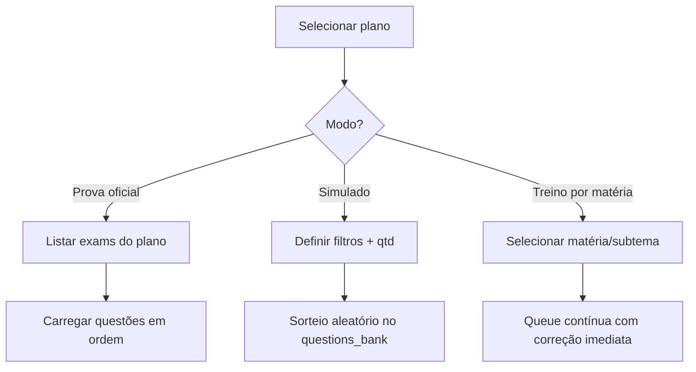

# Plano do Modo Provas & Banco de Questões

> Objetivo: criar o modo mais completo de simulados para concurseiros, conectando banco de questões, provas oficiais e inteligência com IA.

---

## 1. Visão Geral

- **Experiência do usuário**
  - Tela "Provas & Simulados" com provas oficiais filtradas por edital e simulados customizados.
  - Cronômetro modo prova com contagem regressiva, bloqueio de pausa e resumo final.
  - Correção instantânea + feedback por matéria e recomendações automáticas.
- **Backoffice**
  - Interface interna (ou job server-side) para importar provas oficiais (PDF/CSV) com gabarito.
  - Ferramentas de revisão e tagging (matéria, subtema, banca, dificuldade).
- **IA / LangChain** (futuro)
  - Geração de explicação detalhada por questão.
  - Chat com a questão (Professor IA).
  - Classificação automática de dificuldade/subtemas.

---

## 2. Arquitetura de Dados (Firestore)

```
exams/                # Provas oficiais
  id:
    name: "TJBA Juiz 2026"
    planId: "..."         # opcional (associar ao plano)
    banca: "FCC"
    year: 2026
    questions: [questionId]
    durationMinutes: 240
    createdAt / updatedAt

questions_bank/
  id:
    statement: string
    alternatives: [{ key: "A", text: string }, ...]
    answer: "C"
    explanation: string (manual ou gerada)
    materia: "Direito Constitucional"
    subtema: "Controle de Constitucionalidade"
    banca: "CESPE"
    year: 2024
    difficulty: "medio" | "dificil" | ...
    tags: ["Lei 9.868", "STF"]
    sourceExamId: examId | null
    metadata: { lawRefs: [], images: [] }
    createdBy: userId
    createdAt / updatedAt

question_attempts/
  id:
    userId
    planId
    questionId
    examId | null
    selected: "D"
    correct: true/false
    timeSpentSeconds: 75
    attemptType: "exam" | "simulado" | "treino"
    createdAt

simulated_configs/ (opcional)
  id:
    userId
    planId
    filters: { materias: [], dificuldade: [], banca: [] }
    questionCount: 20
    durationMinutes: 120
    createdAt
```

### Regras de Segurança
- Usuários podem **ler** `questions_bank`, `exams`.
- Apenas admins (role) podem criar/editar questões oficiais.
- Usuários podem criar `question_attempts` somente com `userId` próprio.
- Importação deve rodar em ambiente server-side com credenciais administrativas (fora do app web) para garantir consistência.

---

## 3. Pipeline de Ingestão

1. **Fonte**: PDFs de provas oficiais + gabaritos, ou CSV fornecido pela banca.
2. **Formato intermediário**: JSON/CSV com campos padronizados (`statement`, `alternatives`, `answer`, `materia`, ...).
3. **Serviço de importação** (job/API interna):
   - Valida duplicidade (hash do enunciado + ano).
   - Normaliza texto (acentos, maiúsculas/minúsculas, espaçamento).
   - Envia para `questions_bank` em lotes (Batch Write).
   - Cria registro em `exams` com a ordem das questões.
4. **LangChain (fase posterior)**:
   - Parser automático de PDF → JSON.
   - Geração de explicação (`ChatOllama` + prompt de professor).

---

## 4. Filtros & Buscas

- **Filtros principais**: Matéria, subtema, banca, ano, dificuldade, tag.
- **Modo Estudo Livre**: usuário seleciona filtros e recebe fila contínua de questões (corrigidas uma a uma).
- **Modo Simulado**: seleciona quantidade, duração, filtros; sistema sorteia questões e salva ordem.
- **Modo Prova Oficial**: segue ordem fixa do `exam` cadastrado.

### Fluxo dos filtros



---

## 5. UI / UX (v1)

1. **Dashboard → Card "Provas & Simulados"**
   - Tabs: "Provas Oficiais", "Simulados", "Treinar Matéria".
   - Cards com status (disponível, em andamento, melhores notas).
2. **Execução da prova**
   - Layout split: enunciado à esquerda, alternativas à direita.
   - Barra lateral com timer, progresso, botão "Marcar para revisar".
   - Navegação sequencial (próxima/anterior) ou grid de questões.
3. **Resultado**
   - Percentuais gerais e por matéria.
   - Comparativo com tentativas anteriores (gráfico de evolução).
   - Sugestões automáticas ("reforce Constitucional", "faça X questões de Raciocínio Lógico").

### 5.1 Wireframe — Aba "Provas & Simulados"

```
+-------------------------------------------------------------+
|  Header (Plano atual + métricas rápidas)                    |
+-------------------------------------------------------------+
|  Tabs: [ Provas Oficiais ] [ Simulados ] [ Treino Rápido ]  |
+-------------------------------------------------------------+
|  Provas Oficiais                                           |
|  +----------------------+  +----------------------+        |
|  | TJBA Juiz 2026       |  | PGM Rio 2025        |        |
|  | 25 questões • FCC    |  | 60 questões • FGV   | ...    |
|  | Última nota: 78%     |  | Melhor nota: 82%    |        |
|  | [Iniciar] [Detalhes] |  | [Iniciar]           |        |
|  +----------------------+  +----------------------+        |
+-------------------------------------------------------------+
|  Simulados Personalizados                                   |
|  +---------------------------+  +-------------------------+ |
|  | Simulado "Blitz Constitucional" | ...                  | |
|  | 20 questões • 40 min            | CTA Iniciar          | |
|  +---------------------------+  +-------------------------+ |
+-------------------------------------------------------------+
|  Treino Rápido por Matéria                                  |
|  +----------------------------------------------+           |
|  | Matéria: [select]  Subtema: [select]         |           |
|  | Quantidade: [10]   Dificuldade: [todos]      | [Começar] |
|  +----------------------------------------------+           |
+-------------------------------------------------------------+
```

### 5.2 Wireframe — Execução da Prova/Simulado

```
+-------------------------------------------------------------+
|  Header: Prova (TJBA 2026)  Timer [02:13:45]  Progresso 5/25 |
+-------------------------------------------------------------+
|  Conteúdo (70%)                    |  Sidebar (30%)         |
|  +------------------------------+  | +-------------------+  |
|  | Enunciado completo           |  | | Timer circular   |  |
|  | (suporte a tabelas/imagens)  |  | +-------------------+  |
|  +------------------------------+  | | Grid 1..25 com    |  |
|  | Alternativa A (card)         |  | | estados: respond.|  |
|  | Alternativa B                |  | | marcar p/ revisar|  |
|  | ...                          |  | +-------------------+  |
|  | [Marcar para revisar]        |  | | Botões: Próx/Anterior|
|  +------------------------------+  | | Finalizar Prova   |  |
|                                    | +-------------------+  |
+-------------------------------------------------------------+
```

### 5.3 Wireframe — Resultado

```
+-------------------------------------------------------------+
|  Resultado Geral: ✅ 76%  | Tempo gasto 3h20  | Ranking     |
+-------------------------------------------------------------+
|  Cards por matéria                                         |
|  +-------------------+  +-------------------+               |
|  | Constitucional    |  | Administrativo    |               |
|  | 80%  (▲ +10)      |  | 55%  (▼ -5)       |               |
|  +-------------------+  +-------------------+               |
+-------------------------------------------------------------+
|  Lista de Questões                                         |
|  #5  ❌  Sua resposta: B  Correta: D  [Ver explicação]       |
|  #6  ✅  ...                                                |
|  ...                                                       |
+-------------------------------------------------------------+
```

---

## 6. Integração com Cronômetro & Métricas

- Modo prova reutiliza `useStudyTimer` com presets (ex.: duração definida pela prova/simulado).
- Ao finalizar, gera `question_attempts` + sessão no cronômetro (para manter estatística de horas).
- Painel "Plano vs Real" passa a considerar tempo e acerto das questões.

---

## 7. Roadmap de Implementação

1. **Modelagem & Regras** (documento + atualizações em `firestore.rules`).
2. **Fluxo de ingestão server-side** (CSV/JSON → Firestore) e import inicial de algumas provas.
3. **Endpoints/helpers** no `lib/firebase/questions.ts` (CRUD, filtros, sorteio).
4. **UI Provas & Simulados** (listagem + execução + resultado).
5. **Métricas e notificações** integradas.
6. **Fase IA**: parser de provas, explicações automáticas, chat com a questão.

---

## 8. Próximas Ações Imediatas

- [ ] Implementar `questions.ts` (tipos + funções Firestore).
- [ ] Atualizar `firestore.rules` com coleções de provas/questões/tentativas.
- [ ] Criar fluxo de import inicial server-side (ex.: TJBA Juiz 2026).
- [ ] Desenhar layout da tela "Provas & Simulados" e coletar feedback.

> Este plano será nosso blueprint para o modo Provas — podemos ir refinando conforme surgirem novas necessidades.
