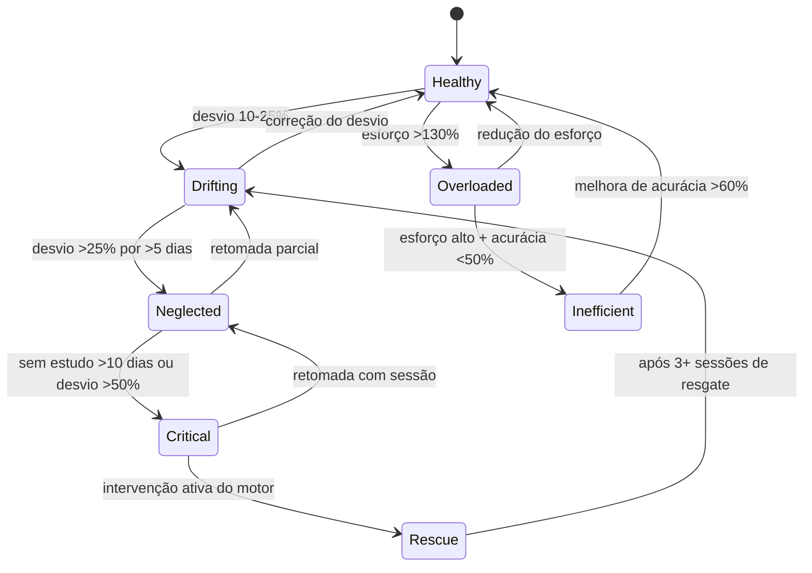

# Regra de Negócio Oficial — AprovaMind

> **Versão**: 1.0  
> **Data**: 2026-03-08  
> **Classificação**: Documento Interno — Regra de Negócio Oficial  
> **Autoria**: Product Architecture + Domain Strategy

---

## 1. Visão Oficial do Produto

**AprovaMind é um sistema de direção estratégica de estudos para concursos públicos.**

Não é um tracker. Não é um dashboard. Não é um chat de IA.  
É um **motor de decisão** que mede esforço real, interpreta a saúde de cada matéria, detecta negligência e ineficiência, calcula prioridade e recomenda ações concretas — adaptando a estratégia conforme edital, desempenho e proximidade da prova.

> O estudante não precisa decidir o que estudar. O sistema decide por ele, com base em dados reais e regras determinísticas.

---

## 2. Problema Central

O concurseiro enfrenta um problema de **decisão sob incerteza e pressão temporal**:

| Dimensão | Problema |
|----------|----------|
| **Volume** | Não sabe se estuda o suficiente |
| **Distribuição** | Não sabe se está equilibrando as matérias corretamente |
| **Eficiência** | Não sabe se o estudo está gerando retenção real |
| **Negligência** | Não percebe que está abandonando matérias críticas |
| **Adaptação** | Não ajusta a estratégia quando o cenário muda (prova próxima, novo edital, queda de desempenho) |
| **Paralisia** | Tem tantas matérias que trava na hora de escolher o que fazer agora |

**Nenhuma plataforma atual resolve esses problemas de forma integrada e determinística.** A maioria oferece cronômetros passivos, dashboards descritivos ou chatbots sem fundamento analítico.

---

## 3. Proposta de Valor

> **"AprovaMind dirige sua preparação. Você executa."**

O sistema transforma dados brutos de estudo e desempenho em **direção estratégica contínua**:

```
Esforço Real → Saúde da Matéria → Detecção de Riscos → Prioridade Calculada → Ação Prescrita → Adaptação Contínua
```

O valor não está em "quanto o usuário estudou" (passado). Está em **"o que ele deve fazer agora"** (presente) e **"o que acontece se ele não fizer"** (futuro).

---

## 4. Princípios de Negócio

### 4.1 Princípios Fundamentais

| # | Princípio | Implicação |
|---|-----------|------------|
| 1 | **Dados reais, não intenções** | O sistema opera sobre horas líquidas efetivamente registradas e questões efetivamente respondidas. Planos "previstos" são inputs de referência, não métricas de sucesso |
| 2 | **Regra determinística primeiro** | Toda decisão estratégica é computável por regras. A IA entra como camada de explicação e prescrição sobre outputs já calculados |
| 3 | **Matéria é a unidade atômica** | Todo cálculo, diagnóstico e recomendação converge para a matéria dentro de um plano |
| 4 | **Sem opinião sem dado** | O sistema nunca sugere algo que não possa justificar com pelo menos uma métrica |
| 5 | **Adaptação é obrigatória** | Estratégia fixa é estratégia morta. O sistema recalcula prioridades a cada ciclo |
| 6 | **Transparência sobre black boxes** | O estudante pode ver exatamente por que o sistema recomendou X. Não há "mágica de IA" |
| 7 | **Prescrição > Descrição** | Mostrar um gráfico é descrição. Dizer "estude Constitucional por 45min focando no capítulo de direitos fundamentais" é prescrição. O produto busca o segundo |

### 4.2 Princípio de Separação de Responsabilidades

```
┌─────────────────────────────────────────────────────────────┐
│  CAMADA 1 — Coleta                                         │
│  Cronômetro, registro de questões, parse de edital          │
│  → Produz: StudySession, QuestionSession, StudyPlan         │
├─────────────────────────────────────────────────────────────┤
│  CAMADA 2 — Computação (Decision Engine)                   │
│  Regras determinísticas, fórmulas, limiares                 │
│  → Produz: SubjectHealth, Priority, Recommendations         │
├─────────────────────────────────────────────────────────────┤
│  CAMADA 3 — Interpretação (IA)                             │
│  Explicação em linguagem natural sobre os outputs           │
│  → Produz: Texto contextualizado, mentoria, coaching        │
├─────────────────────────────────────────────────────────────┤
│  CAMADA 4 — Apresentação (UI)                              │
│  Dashboard, cards, alertas, planner                         │
│  → Produz: Experiência visual e acional                     │
└─────────────────────────────────────────────────────────────┘
```

> [!IMPORTANT]
> A IA (Camada 3) **nunca** origina uma regra. Ela recebe os dados computados pela Camada 2 e os traduz em linguagem acessível.

---

## 5. Definições Formais

### 5.1 StudyPlan (Plano de Estudo)

Representa um edital ou concurso alvo ao qual o estudante se dedica.

| Campo | Tipo | Descrição |
|-------|------|-----------|
| `id` | `string` | Identificador único |
| `userId` | `string` | Proprietário |
| `name` | `string` | Nome do concurso/edital (ex: "PGE-SP 2026") |
| `subjects` | `SubjectPlan[]` | Lista de matérias com pesos e metas |
| `weeklyGoalHours` | `number` | Meta semanal global do plano (horas) |
| `examDate` | `string \| null` | Data prevista da prova (ISO date) |
| `color` | `string` | Cor identificadora (hex) |
| `isDefault` | `boolean` | Plano genérico auto-criado |
| `createdAt` | `string` | Timestamp de criação |
| `updatedAt` | `string` | Timestamp de atualização |

**Regras:**
- Todo usuário tem pelo menos 1 plano (o "Geral", auto-criado)
- Um plano pode ter 0 a N matérias
- A soma de `weight` dos `SubjectPlan[]` deve ser 100%
- `examDate` é opcional — quando preenchido, ativa o **modo contagem regressiva** que intensifica urgência

---

### 5.2 SubjectPlan (Plano por Matéria)

Representa a configuração estratégica de uma matéria dentro de um plano.

| Campo | Tipo | Descrição |
|-------|------|-----------|
| `subject` | `string` | Nome da matéria |
| `weight` | `number` | Peso relativo no edital (0–100, soma=100) |
| `weeklyTargetHours` | `number` | Meta semanal derivada: `(weight / 100) × weeklyGoalHours` |
| `priorityOverride` | `number \| null` | Override manual de prioridade (1=máxima) |

**Regras:**
- `weeklyTargetHours` é **computado**, não definido pelo usuário diretamente
- `priorityOverride` só é válido quando definido explicitamente pelo estudante — caso contrário, a prioridade é calculada pelo motor

---

### 5.3 StudySession (Sessão de Estudo)

Representa um bloco de estudo efetivamente realizado.

| Campo | Tipo | Descrição |
|-------|------|-----------|
| `id` | `string` | Identificador único |
| `userId` | `string` | Proprietário |
| `planId` | `string` | Plano associado |
| `subject` | `string` | Matéria estudada |
| `subtopic` | `string \| null` | Subtópico específico |
| `duration` | `number` | Duração líquida em **segundos** |
| `date` | `string` | Data da sessão (YYYY-MM-DD) |
| `startTime` | `string` | Início (ISO) |
| `endTime` | `string` | Fim (ISO) |
| `source` | `'timer' \| 'manual'` | Origem da sessão |
| `wasEdited` | `boolean` | Se foi ajustada manualmente |
| `createdAt` | `string` | Timestamp de criação |

**Regras:**
- Sessões `source: 'timer'` são a verdade fundamental — Page Visibility API garante horas líquidas
- Sessões `source: 'manual'` são aceitas mas carregam flag de confiabilidade menor
- `duration` mínimo para contabilização: **60 segundos** (sessões < 60s são descartadas)
- Uma sessão não pode ter `duration` > 14400 (4 horas) sem flag `wasEdited`

---

### 5.4 QuestionSession (Sessão de Questões)

Representa um lote de questões resolvidas em uma matéria.

| Campo | Tipo | Descrição |
|-------|------|-----------|
| `id` | `string` | Identificador único |
| `userId` | `string` | Proprietário |
| `planId` | `string` | Plano associado |
| `subject` | `string` | Matéria avaliada |
| `totalQuestions` | `number` | Total de questões respondidas |
| `correctAnswers` | `number` | Total de acertos |
| `accuracy` | `number` | Percentual de acerto (0–100) |
| `date` | `string` | Data (YYYY-MM-DD) |
| `createdAt` | `string` | Timestamp |

**Regras:**
- `accuracy` = `(correctAnswers / totalQuestions) × 100`
- Sessões com `totalQuestions < 5` têm **baixa significância estatística** e recebem peso menor no cálculo de saúde
- Questões de simulados (`QuestionAttempt`) alimentam `QuestionSession` via agregação pós-prova

---

### 5.5 SubjectHealth (Saúde da Matéria)

> **Entidade computada — não é persistida diretamente.** É recalculada pelo Decision Engine a cada ciclo.

Representa o diagnóstico estratégico de uma matéria em um dado momento.

| Campo | Tipo | Descrição |
|-------|------|-----------|
| `subject` | `string` | Nome da matéria |
| `planId` | `string` | Plano de referência |
| `status` | `StrategicStatus` | Estado estratégico (ver seção 6) |
| `effortScore` | `number` (0–100) | Quanto o estudante se esforçou nesta matéria relativo à meta |
| `efficiencyScore` | `number` (0–100) | Qual a taxa de acerto recente |
| `consistencyScore` | `number` (0–100) | Quão regular foi o estudo nos últimos 14 dias |
| `priorityScore` | `number` (0–100) | Prioridade calculada (100 = máxima urgência) |
| `weeklyActualHours` | `number` | Horas líquidas na semana corrente |
| `weeklyTargetHours` | `number` | Meta semanal derivada do peso |
| `deviationPercent` | `number` | `((actual - target) / target) × 100` |
| `recentAccuracy` | `number \| null` | Acurácia nos últimos 30 dias |
| `previousAccuracy` | `number \| null` | Acurácia dos 30 dias anteriores |
| `accuracyTrend` | `'improving' \| 'stable' \| 'declining' \| 'unknown'` | Tendência |
| `daysSinceLastStudy` | `number` | Dias corridos desde a última sessão nesta matéria |
| `daysSinceLastQuestion` | `number \| null` | Dias desde a última sessão de questões |
| `totalHoursAllTime` | `number` | Volume acumulado histórico |
| `totalQuestionsAllTime` | `number` | Questões resolvidas historicamente |

**Fórmulas:**

```
effortScore = clamp(0, 100, (weeklyActualHours / weeklyTargetHours) × 100)

efficiencyScore = recentAccuracy ?? 0

consistencyScore = (diasComEstudo nos últimos 14 dias / 14) × 100

priorityScore = f(weight, deviationPercent, daysSinceLastStudy, accuracyTrend, examProximity)
```

---

### 5.6 Recommendation (Recomendação)

Representa uma ação concreta prescrita pelo motor de decisão.

| Campo | Tipo | Descrição |
|-------|------|-----------|
| `id` | `string` | Identificador único |
| `type` | `RecommendationType` | Tipo da recomendação |
| `subject` | `string` | Matéria alvo |
| `action` | `string` | Descrição da ação (ex: "Estudar Constitucional por 45min com foco em Direitos Fundamentais") |
| `reason` | `string` | Justificativa computada (ex: "Desvio de -35% na meta semanal, 8 dias sem estudo") |
| `priority` | `number` (1–5) | Urgência (1=crítica, 5=opcional) |
| `estimatedMinutes` | `number` | Tempo sugerido |
| `category` | `'study' \| 'review' \| 'questions' \| 'rest'` | Categoria da ação |
| `source` | `'engine'` | Sempre `engine` — a IA não gera recomendações originais |
| `createdAt` | `string` | Timestamp |

**Tipos de Recomendação (`RecommendationType`):**

| Tipo | Gatilho | Ação |
|------|---------|------|
| `rescue` | Matéria em estado `critical` ou `neglected` por >7 dias | Sessão de resgate imediata |
| `rebalance` | Distribuição de esforço desviada >20% da meta | Redistribuir horas |
| `deepen` | Matéria com esforço alto mas acurácia baixa (<60%) | Trocar estudo teórico por questões |
| `maintain` | Matéria saudável | Manter ritmo |
| `celebrate` | Matéria superando metas em esforço e acurácia | Reconhecer progresso |
| `rest` | Overtraining detectado (esforço >150% da meta sustentado) | Moderar intensidade |
| `exam_push` | Prova em <30 dias, matéria com peso alto e saúde baixa | Modo intensivo |

---

### 5.7 PlanningWindow (Janela de Planejamento)

Representa o horizonte temporal para os cálculos do motor.

| Campo | Tipo | Descrição |
|-------|------|-----------|
| `type` | `'daily' \| 'weekly' \| 'sprint'` | Tipo de janela |
| `startDate` | `string` | Início (YYYY-MM-DD) |
| `endDate` | `string` | Fim (YYYY-MM-DD) |
| `availableHours` | `number` | Horas disponíveis no período |
| `daysRemaining` | `number \| null` | Dias até a prova (se `examDate` estiver definido) |
| `urgencyMultiplier` | `number` | Fator 1.0–3.0 que escala prioridade conforme proximidade da prova |

**Regras de urgência:**

| Dias até a prova | `urgencyMultiplier` |
|------------------|---------------------|
| > 90 dias | 1.0 (normal) |
| 60–90 dias | 1.3 (atenção) |
| 30–60 dias | 1.7 (intensificação) |
| 15–30 dias | 2.2 (sprint) |
| < 15 dias | 3.0 (modo prova) |
| Sem data de prova | 1.0 (normal) |

---

## 6. Estados Estratégicos da Matéria

Cada matéria dentro de um plano possui um **estado estratégico** computado pelo Decision Engine.



| Estado | Código | Condição | Cor | Ação do Motor |
|--------|--------|----------|-----|----------------|
| **Healthy** | `healthy` | Esforço 80–120% da meta, acurácia ≥65% ou sem dados | 🟢 Verde | Manter ritmo |
| **Drifting** | `drifting` | Desvio 10–25% abaixo da meta | 🟡 Amarelo | Alerta suave, sugerir sessão |
| **Neglected** | `neglected` | Desvio >25% ou >5 dias sem sessão | 🟠 Laranja | Priorizar, gerar recomendação `rescue` |
| **Critical** | `critical` | Desvio >50% ou >10 dias sem sessão, com peso >10% | 🔴 Vermelho | Recomendação `rescue` urgente, alerta no dashboard |
| **Rescue** | `rescue` | Motor ativou protocolo de resgate | 🔴 Vermelho pulsante | Sessões direcionadas, monitoramento ativo |
| **Overloaded** | `overloaded` | Esforço >130% da meta sustentado (>7 dias) | 🔵 Azul | Sugerir redistribuição ou descanso |
| **Inefficient** | `inefficient` | Esforço alto (>100%) mas acurácia <50% em >20 questões | 🟣 Roxo | Sugerir mudança de método (mais questões, revisar teoria) |

> [!NOTE]
> Um estado não é "definido" pelo usuário. É **computado** a cada ciclo do motor com base nos dados brutos.

---

## 7. Regras Centrais do Produto

### 7.1 Regra de Ouro — Esforço Real
O sistema **nunca** usa "horas planejadas" como métrica de sucesso. Apenas horas líquidas efetivamente registradas pelo timer (ou lançamentos manuais com flag explícito) contam como esforço.

### 7.2 Regra de Distribuição
A distribuição de esforço ideal é derivada dos **pesos do edital**. Se Constitucional tem peso 20% e a meta semanal é 20h, a meta de Constitucional é 4h/semana. Desvios desta meta acionam alertas e rebalanceamento.

### 7.3 Regra de Negligência
Uma matéria é negligenciada quando:
- `deviationPercent < -25%` **OU**
- `daysSinceLastStudy > 5` (para matérias com `weight ≥ 5%`)

### 7.4 Regra de Ineficiência
Uma matéria é ineficiente quando:
- `effortScore ≥ 100` (estuda o suficiente ou mais) **E**
- `efficiencyScore < 50` (acurácia abaixo de 50% com amostra ≥ 20 questões)

### 7.5 Regra de Prioridade

```
priorityScore = (
    weightFactor × 0.30
  + deviationFactor × 0.25
  + recencyFactor × 0.20
  + accuracyFactor × 0.15
  + examProximityFactor × 0.10
) × urgencyMultiplier
```

Onde:
- `weightFactor` = `weight` normalizado (0–100). Matérias de peso maior têm prioridade base maior
- `deviationFactor` = `max(0, -deviationPercent)` (só penaliza desvio negativo)
- `recencyFactor` = `min(100, daysSinceLastStudy × 10)` (quanto mais tempo sem estudar, maior)
- `accuracyFactor` = `max(0, 100 - recentAccuracy)` (quanto menor a acurácia, maior a prioridade)
- `examProximityFactor` = `urgencyMultiplier × 20` (escala com proximidade da prova)

### 7.6 Regra de Sessão Mínima Significativa
- Sessão de estudo: **≥ 1 minuto** (60 segundos)
- Sessão de questões: **≥ 5 questões** para ter significância estatística

### 7.7 Regra do Ciclo de Recálculo
O Decision Engine recalcula `SubjectHealth` e gera `Recommendations` sempre que:
1. Uma nova `StudySession` é registrada
2. Uma nova `QuestionSession` é registrada
3. O usuário abre o dashboard (ciclo passivo a cada acesso)
4. O planner diário é solicitado

### 7.8 Regra de Tendência de Acurácia

| Condição | `accuracyTrend` |
|----------|------------------|
| `recentAccuracy - previousAccuracy ≥ +5pp` | `improving` |
| `\|recentAccuracy - previousAccuracy\| < 5pp` | `stable` |
| `recentAccuracy - previousAccuracy ≤ -5pp` | `declining` |
| Sem dados suficientes (<10 questões em algum período) | `unknown` |

---

## 8. Núcleo de Decisão (Decision Engine)

### 8.1 Arquitetura

```mermaid
graph LR
    subgraph Inputs
        S[StudySessions]
        Q[QuestionSessions]
        P[StudyPlan + SubjectPlans]
        W[PlanningWindow]
    end

    subgraph Engine["Decision Engine (Determinístico)"]
        H[Compute SubjectHealth]
        PR[Compute PriorityScore]
        ST[Determine StrategicStatus]
        R[Generate Recommendations]
    end

    subgraph Outputs
        SH[SubjectHealth[]]
        REC[Recommendation[]]
        PLAN[DailyPlan]
    end

    S --> H
    Q --> H
    P --> H
    W --> PR
    H --> PR
    H --> ST
    PR --> R
    ST --> R
    R --> REC
    R --> PLAN
    H --> SH
```

### 8.2 Pipeline de Execução

1. **Coleta de Dados**
   - Buscar todas as `StudySession` dos últimos 30 dias para o plano ativo
   - Buscar todas as `QuestionSession` dos últimos 60 dias para o plano ativo
   - Carregar o `StudyPlan` com `SubjectPlan[]`

2. **Cálculo de SubjectHealth** (para cada matéria do plano)
   - Computar `weeklyActualHours` (soma de duração das sessões na semana corrente)
   - Computar `weeklyTargetHours` (derivada do peso)
   - Computar `deviationPercent`
   - Computar `effortScore`, `efficiencyScore`, `consistencyScore`
   - Computar `daysSinceLastStudy` e `daysSinceLastQuestion`
   - Computar `recentAccuracy` e `previousAccuracy` → `accuracyTrend`
   - Determinar `status` conforme regras da seção 6

3. **Cálculo de Prioridade** (para cada matéria)
   - Aplicar fórmula da seção 7.5
   - Multiplicar por `urgencyMultiplier` da `PlanningWindow`
   - Ordenar matérias por `priorityScore` descendente

4. **Geração de Recomendações**
   - Para cada matéria, gerar 0–N recomendações conforme seu estado e prioridade
   - Recomendação do tipo `rescue` para matérias `critical` (prioridade 1)
   - Recomendação do tipo `rebalance` para matérias `neglected` (prioridade 2)
   - Recomendação do tipo `deepen` para matérias `inefficient` (prioridade 2)
   - Recomendação do tipo `rest` para matérias `overloaded` (prioridade 3)
   - Recomendação do tipo `maintain` para matérias `healthy` (prioridade 4)
   - Recomendação do tipo `celebrate` para matérias superando metas (prioridade 5)

5. **Composição do Plano Diário**
   - Selecionar as top 3–5 matérias por `priorityScore`
   - Distribuir o tempo disponível proporcionalmente à prioridade
   - Definir a ação para cada bloco (teoria, questões, revisão)

---

## 9. Outputs do Sistema

### 9.1 SubjectHealth Report (Relatório de Saúde)

Visão consolidada de todas as matérias do plano ativo, com estado estratégico, scores e tendências. Apresentado como tabela/cards no dashboard.

**Frequência:** A cada acesso ao dashboard.

### 9.2 Daily Action Plan (Plano de Ação Diário)

Lista ordenada de sessões recomendadas para o dia, com matéria, duração e tipo de atividade.

**Exemplo de output:**

```json
{
  "date": "2026-03-08",
  "planId": "pge-sp-2026",
  "totalMinutes": 180,
  "blocks": [
    {
      "order": 1,
      "subject": "Direito Constitucional",
      "minutes": 50,
      "activity": "questions",
      "reason": "Acurácia em queda (-8pp). Priorizar questões para diagnóstico de gaps."
    },
    {
      "order": 2,
      "subject": "Direito Administrativo",
      "minutes": 45,
      "activity": "study",
      "reason": "7 dias sem estudo. Peso 18% no edital. Retomar base teórica."
    },
    {
      "order": 3,
      "subject": "Português",
      "minutes": 40,
      "activity": "study",
      "reason": "Desvio -15% na meta semanal. Matéria eliminatória."
    },
    {
      "order": 4,
      "subject": "Direito Civil",
      "minutes": 45,
      "activity": "review",
      "reason": "Acurácia estável em 72%. Revisão espaçada para consolidação."
    }
  ]
}
```

### 9.3 Weekly Strategic Report (Relatório Estratégico Semanal)

Diagnóstico completo da semana com:
- Total de horas líquidas vs meta
- Matérias em cada estado estratégico
- Variação de acurácia por matéria
- Recomendações para a próxima semana
- Alertas de negligência/ineficiência

**Frequência:** Gerado 1x/semana (domingo à noite ou segunda pela manhã).

### 9.4 Real-Time Alerts (Alertas em Tempo Real)

Alertas acionados por eventos específicos:

| Alerta | Gatilho | Apresentação |
|--------|---------|--------------|
| **Negligência** | Matéria transita para `neglected` | Badge no dashboard + notificação |
| **Ineficiência** | Matéria transita para `inefficient` | Card de insight + sugestão de ação |
| **Streak em risco** | 1 dia sem estudar após streak ≥ 3 | Notificação push |
| **Meta semanal em risco** | Sexta-feira com <60% da meta atingida | Insight urgente |
| **Sprint ativado** | Prova em <30 dias | Banner persistente no topo |
| **Celebração** | Meta semanal batida ou matéria superando metas | Toast de celebração |

### 9.5 Post-Session Feedback (Feedback Pós-Sessão)

Após cada sessão no cronômetro:

```json
{
  "subject": "Direito Constitucional",
  "sessionMinutes": 47,
  "impact": {
    "weeklyProgress": "62% → 78%",
    "subjectStatus": "neglected → drifting",
    "message": "Boa sessão! Constitucional saiu do estado negligenciado. Mais 1h30 esta semana para atingir a meta."
  },
  "nextRecommendation": {
    "subject": "Direito Administrativo",
    "reason": "Próxima matéria prioritária: 5 dias sem estudo."
  }
}
```

---

## 10. Papel Correto da IA

### 10.1 O que a IA FAZ

| Responsabilidade | Exemplo |
|------------------|---------|
| **Explicar** o diagnóstico | "Constitucional está em estado crítico porque você não estuda há 12 dias e o desvio acumulado é de -47%." |
| **Contextualizar** a recomendação | "Sugiro uma sessão de 45min com foco em questões de Direitos Fundamentais — sua acurácia neste tema está abaixo da média geral." |
| **Motivar** com dados | "Nas últimas 3 semanas, sua acurácia em Administrativo subiu 12pp. Continue nesse ritmo." |
| **Prescrever texto de mentoria** | Elaborar o relatório semanal em linguagem acessível a partir dos outputs do Engine |
| **Responder perguntas** sobre estratégia | "Por que estou estudando Português se ela tem peso baixo?" → Resposta baseada em dados |
| **Adaptar o tom** | Concurseiro em streak de 15 dias recebe tom de celebração; concurseiro com 7 dias sem estudar recebe tom de urgência empática |

### 10.2 O que a IA NÃO FAZ

| Proibição | Motivo |
|-----------|--------|
| ❌ Decidir qual matéria priorizar | Isso é responsabilidade do `priorityScore` do Engine |
| ❌ Criar regras de negócio | Regras são código determinístico, não outputs de LLM |
| ❌ Inventar dados | Toda informação vem do Firestore e do Engine |
| ❌ Contradizer o Engine | Se o Engine diz que Constitucional é prioridade 1, a IA não pode sugerir outra matéria |
| ❌ Dar opinião sem dado | "Acho que você deveria estudar mais X" é proibido sem métrica de suporte |
| ❌ Substituir o planner | A IA narra o planner. Não o origina |

### 10.3 Contrato Input/Output da IA

```
INPUT para a IA:
  - SubjectHealth[] (computado pelo Engine)
  - Recommendation[] (computado pelo Engine)
  - PlanningWindow (contexto temporal)
  - UserProfile (nome, preferências)
  - ConversationContext (se chat)

OUTPUT da IA:
  - Texto em linguagem natural
  - Nunca JSON estruturado que substitua o Engine
  - Sempre referencia os dados de input explicitamente
```

---

## 11. Riscos e Ambiguidades de Produto

### 11.1 Riscos Identificados

| # | Risco | Impacto | Mitigação |
|---|-------|---------|-----------|
| 1 | **Estudante não usa o timer** | SubjectHealth fica sem dados → Motor não funciona | Onboarding forte + lançamento manual como fallback + alertas de dados insuficientes |
| 2 | **Estudante só registra horas, não faz questões** | `efficiencyScore` fica desconhecido → Motor opera com metade dos dados | Distinguir entre "sem dado" (unknown) e "dado ruim". Prompts incentivando registro de questões |
| 3 | **Plano sem pesos definidos** | Sem distribuição ideal → Não há como calcular desvio | Fallback: peso igual para todas as matérias. Alerta: "Defina pesos para ativar análise estratégica" |
| 4 | **Matérias demais (>15)** | Recomendações ficam diluídas | Agrupar matérias relacionadas. Limitar plano diário a 5 blocos. Priorização forte |
| 5 | **Lançamento manual abusivo** | Dados falsos comprometem a inteligência | Analytics flaggear padrões suspeitos (ex: 10h/dia manual). Badge "verificado por timer" |
| 6 | **IA alucinando** contra Engine | Conflito de informação → Perda de confiança | Contrato rígido: IA recebe JSON do engine, não acessa Firestore diretamente |
| 7 | **Data de prova indefinida** | Sem urgencyMultiplier → Motor opera em modo flat | Aceitar. Urgency = 1.0. Incentivar definição de data |

### 11.2 Ambiguidades Pendentes

| # | Questão em Aberto | Status |
|---|-------------------|--------|
| 1 | O motor deve considerar **subtópicos** na priorização ou apenas matérias? | A decidir. V1 = apenas matérias. V2 = subtópicos opcionais |
| 2 | O `weeklyGoalHours` do plano deve ser **por edital** ou **global** do usuário? | Decisão: por edital. Cada plano tem sua meta |
| 3 | Quando o usuário tem múltiplos editais, o motor diário deve recomendar sessões **cross-edital**? | A decidir. V1 = por edital ativo. V2 = visão consolidada com prioridade cross |
| 4 | O `consistencyScore` deve considerar finais de semana? | A decidir. Default: sim, todos os dias contam. Futuro: configurável |
| 5 | Deve existir um **modo de revisão espaçada** como output separado do planner? | A decidir. Potencial V2/V3 |

---

## 12. Decisões Oficiais de Produto

As decisões abaixo são consideradas **oficiais e vigentes** até revisão formal.

| # | Decisão | Justificativa |
|---|---------|---------------|
| 1 | **A unidade atômica é a matéria, não o subtópico** | Subtópicos são opcionais e granulares demais para o motor V1. Matéria é a unidade que o edital define |
| 2 | **O motor é determinístico, não probabilístico** | Regras claras são auditáveis e explicáveis. LLMs são camada de texto, não de decisão |
| 3 | **Horas líquidas são a métrica fundamental de esforço** | Diferencial do produto. Page Visibility API garante confiabilidade |
| 4 | **A IA recebe outputs do Engine como input, não dados brutos** | Reduz alucinação, garante consistência, mantém a IA como camada de explicação |
| 5 | **Cada plano/edital é um universo independente** | O dashboard, motor e recomendações operam no escopo do plano ativo |
| 6 | **O planner diário é o feature âncora premium** | É o output de maior valor: "o que estudar agora". Free users veem insights simples |
| 7 | **StudySession com `duration < 60s` é descartada** | Sessões acidentais ou de teste não devem poluir dados |
| 8 | **O sistema deve funcionar com dados parciais** | Falta de questões → `efficiencyScore = unknown`. Falta de pesos → pesos iguais. O motor nunca trava |
| 9 | **PlanningWindow com examDate é obrigatório para modo sprint** | Sem data, sem urgência. Incentivo para preenchimento |
| 10 | **SubjectHealth é computada, nunca persistida como documento** | Dados mudam a cada sessão. Persistir seria stale data |
| 11 | **O motor roda no client-side com dados já cache-ados** | Performance. Firebase já retorna as sessões. O cálculo é leve e determinístico |
| 12 | **Alertas de negligência são acionados por transição de estado, não por polling** | Quando uma matéria transita de `healthy` → `neglected`, o alerta dispara. Sem polling |

---

## Anexo A — Glossário

| Termo | Definição |
|-------|-----------|
| **Horas líquidas** | Tempo efetivamente ativo na aba de estudo, descontando pausas e trocas de aba |
| **Peso do edital** | Importância relativa de uma matéria no concurso (0–100%, soma=100%) |
| **Desvio** | Diferença percentual entre esforço real e meta. Negativo = abaixo da meta |
| **Estado estratégico** | Classificação computada da saúde de uma matéria (healthy, drifting, neglected, etc.) |
| **Motor de decisão** | Conjunto de regras determinísticas que computam SubjectHealth e Recommendations |
| **Ciclo de recálculo** | Evento que dispara nova execução do motor |
| **Sprint** | Modo ativado quando prova está a <30 dias |
| **Resgate** | Protocolo de intervenção para matérias em estado critical |
| **Cross-edital** | Visão que agrega dados de múltiplos planos/editais |

---

## Anexo B — Mapa de Evolução

| Versão | Foco | Entrega principal |
|--------|------|-------------------|
| **V1** (atual→próximo) | Motor determinístico básico | SubjectHealth + priorityScore + Recommendations + Daily Plan |
| **V2** | Inteligência de revisão | Revisão espaçada por subtópico + curva de esquecimento estimada |
| **V3** | Predição | Modelo preditivo de aprovação baseado em benchmark anônimo + tendências |
| **V4** | Multi-edital inteligente | Motor cross-edital com otimização de tempo global |

---

> **Este documento é a referência canônica para decisões de produto, modelagem de domínio e desenvolvimento do Decision Engine do AprovaMind.**  
> Qualquer implementação que contradiga este documento deve ser reportada e corrigida.
