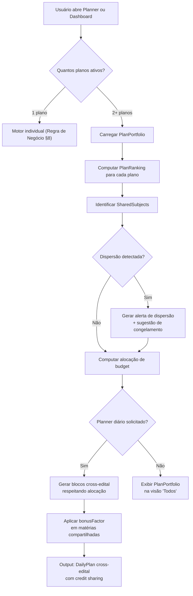

# Regra de Negócio Multi-Edital — AprovaMind

> **Versão**: 1.0  
> **Data**: 2026-03-08  
> **Classificação**: Documento Interno — Regra de Negócio Oficial  
> **Dependência**: [Regra de Negócio Principal](file:///Users/marleite/.gemini/antigravity/brain/a1aad2a5-06e4-47eb-a6fa-168a11c22364/regra_de_negocio_aprovamind.md)

---

## Premissa

Multi-edital não é um filtro visual. É um **problema de alocação de recurso escasso** (tempo) entre objetivos concorrentes (concursos) que possuem prazos, pesos, riscos e retornos diferentes.

O sistema deve tratar múltiplos editais como um **portfólio de investimento**: cada plano tem risco, retorno esperado e prazo. O motor decide a alocação ótima.

---

## 1. Princípios de Negócio para Multi-Edital

| # | Princípio | Implicação |
|---|-----------|------------|
| 1 | **Tempo é finito e compartilhado** | O total de horas disponíveis por semana é um recurso global. Cada plano "compete" por uma fatia desse recurso |
| 2 | **Planos não são iguais** | Cada edital tem urgência, importância e risco próprios. O sistema deve refletir isso, não tratar todos como equivalentes |
| 3 | **Matérias se sobrepõem** | "Direito Constitucional" no plano PGE-SP e no plano TRF1 é a mesma matéria. Estudar uma vez beneficia ambos os planos |
| 4 | **Dispersão é o inimigo** | O maior risco do multi-edital é o estudante pulverizar o tempo entre muitos planos e não se aprofundar em nenhum. O motor deve combater dispersão ativamente |
| 5 | **Prova próxima sempre vence** | A urgência temporal é o fator dominante. Quando uma prova está a <30 dias, esse plano absorve a maior parte dos recursos |
| 6 | **O sistema decide a alocação, o usuário pode ajustar** | A distribuição padrão é computada. O override manual é aceito mas gera alertas se for incoerente |
| 7 | **Visão consolidada é diagnóstico, não ação** | "Todos os Planos" serve para o estudante entender sua situação global. As **ações** sempre operam no escopo de um plano específico |

---

## 2. Entidades Multi-Edital

### 2.1 PlanPortfolio (Portfólio de Planos)

Entidade computada que representa a visão global de todos os planos do usuário.

| Campo | Tipo | Descrição |
|-------|------|-----------|
| `userId` | `string` | Proprietário |
| `plans` | `PlanRanking[]` | Lista ordenada de planos com scores |
| `globalWeeklyBudget` | `number` | Total de horas disponíveis por semana (soma das metas ou definido pelo usuário) |
| `sharedSubjects` | `SharedSubject[]` | Matérias que aparecem em múltiplos planos |
| `riskAlerts` | `PortfolioAlert[]` | Alertas de portfólio |
| `computedAt` | `string` | Timestamp do cálculo |

### 2.2 PlanRanking (Classificação do Plano)

Cada plano recebe um ranking computado que define quanto tempo merece.

| Campo | Tipo | Descrição |
|-------|------|-----------|
| `planId` | `string` | ID do plano |
| `planName` | `string` | Nome do concurso |
| `riskScore` | `number` (0–100) | Quanto risco o plano corre (100 = altíssimo risco) |
| `urgencyScore` | `number` (0–100) | Urgência temporal |
| `healthScore` | `number` (0–100) | Saúde geral (média ponderada das matérias) |
| `userPriority` | `number` (1–5) | Prioridade atribuída manualmente pelo usuário |
| `compositeScore` | `number` (0–100) | Score final que define a alocação |
| `allocatedPercent` | `number` | % do budget semanal alocado para este plano |
| `allocatedHours` | `number` | Horas semanais alocadas |
| `phase` | `PlanPhase` | Fase da preparação |

### 2.3 PlanPhase (Fase da Preparação)

| Fase | Código | Condição | Comportamento do Motor |
|------|--------|----------|------------------------|
| **Construção** | `building` | Sem data de prova ou > 90 dias | Foco em cobertura ampla, todas as matérias, ritmo regular |
| **Consolidação** | `consolidating` | 30–90 dias para a prova | Equilibrar teoria e questões, identificar gaps, intensificar matérias fracas |
| **Sprint** | `sprinting` | 15–30 dias para a prova | Foco em questões e revisão, priorizar matérias de alto peso + baixa acurácia |
| **Final** | `final_push` | < 15 dias para a prova | Priorizar apenas matérias eliminatórias e de alto peso, zero matérias novas, revisão pura |
| **Pós-prova** | `post_exam` | Data da prova já passou | Desativação suave, frequência de estudo reduzida, sugestão de arquivar plano |

### 2.4 SharedSubject (Matéria Compartilhada)

Quando a mesma matéria aparece em múltiplos planos.

| Campo | Tipo | Descrição |
|-------|------|-----------|
| `subject` | `string` | Nome da matéria |
| `planIds` | `string[]` | Planos que contêm essa matéria |
| `maxWeight` | `number` | Maior peso entre os planos |
| `avgWeight` | `number` | Peso médio entre os planos |
| `bonusFactor` | `number` | Fator de eficiência por compartilhamento (1.0–2.0) |

---

## 3. Regra de Priorização Entre Planos

### 3.1 Fórmula do CompositeScore

```
compositeScore = (
    urgencyFactor    × 0.35
  + riskFactor       × 0.25
  + userPriority     × 0.20
  + healthDeficit    × 0.15
  + weightFactor     × 0.05
)
```

**Componentes:**

| Fator | Cálculo | Range |
|-------|---------|-------|
| `urgencyFactor` | Baseado em `daysToExam` conforme tabela abaixo | 0–100 |
| `riskFactor` | `100 - healthScore` (média ponderada de SubjectHealth das matérias do plano) | 0–100 |
| `userPriority` | `(6 - userPriority) × 20` (prioridade 1→100, 5→20) | 20–100 |
| `healthDeficit` | `max(0, 100 - effortCompletionPercent)` onde `effortCompletionPercent = (horasReais/horasMeta) × 100` | 0–100 |
| `weightFactor` | Proporção de matérias em estado `critical` ou `neglected` | 0–100 |

**Urgency por tempo restante:**

| Dias até a prova | `urgencyFactor` |
|------------------|-----------------|
| > 180 dias | 10 |
| 90–180 dias | 25 |
| 60–90 dias | 45 |
| 30–60 dias | 65 |
| 15–30 dias | 85 |
| < 15 dias | 100 |
| Sem data | 15 (baseline baixa) |

### 3.2 Alocação de Tempo

Uma vez calculado o `compositeScore` de cada plano, a distribuição de horas é proporcional:

```
allocatedPercent(planI) = compositeScore(planI) / Σ compositeScore(todos)
allocatedHours(planI) = allocatedPercent(planI) × globalWeeklyBudget
```

**Restrições:**
- Nenhum plano recebe < 10% do budget (mínimo de manutenção)
- Nenhum plano recebe > 70% do budget (salvo se for o único plano ou estiver em `final_push`)
- O total alocado = `globalWeeklyBudget` (soma = 100%)

### 3.3 Override do Usuário

O usuário pode definir `userPriority` (1–5) para cada plano. Isso pesa 20% no composite score.

Além disso, o usuário pode fazer **hard override** da alocação percentual. Nesse caso:

- O sistema aceita a alocação manual
- Gera um alerta se a alocação divergir > 15pp do que o motor calcularia
- O alerta diz: *"Sua alocação manual para PGE-SP (60%) está 18pp acima do recomendado pelo motor (42%). Isso pode negligenciar TRF1."*

---

## 4. Regra de Priorização Dentro do Plano

Dentro de cada plano, a priorização segue as regras do documento principal (Regra de Negócio §7.5), com uma extensão multi-edital:

### 4.1 Bonus de Matéria Compartilhada

Se uma matéria aparece em N planos, o esforço nela gera retorno multiplicado:

```
bonusFactor = 1.0 + (0.15 × (N - 1))   // cap em 2.0
```

**Exemplo:** "Direito Constitucional" aparece em 3 planos:
- `bonusFactor = 1.0 + (0.15 × 2) = 1.30`
- O `priorityScore` dessa matéria é multiplicado por 1.30
- 1 hora de Constitucional "vale" 1.30h no cálculo de eficiência

### 4.2 Credit Sharing

Quando o estudante estuda uma matéria compartilhada no plano A, o sistema credita **automaticamente** essa sessão nos demais planos que contêm a mesma matéria.

**Regras de Credit Sharing:**

| Regra | Detalhe |
|-------|---------|
| Crédito primário | 100% das horas contam para o plano onde a sessão foi registrada |
| Crédito secundário | `creditRate × duration` contam para cada plano adicional |
| `creditRate` padrão | 70% (o conteúdo é similar mas não idêntico entre editais) |
| `creditRate` ajustável | Configável por matéria se o usuário quiser (50%–100%) |
| Exibição | Dashboard mostra "2h30 diretas + 0h45 compartilhadas" |

**Exemplo concreto:**
- Estudante faz 2h de Constitucional no plano "PGE-SP"
- Constitucional também existe no plano "TRF1"
- PGE-SP: contabiliza 2h (100%)
- TRF1: contabiliza 1h24 (70%)

### 4.3 Fase do Plano Modifica Pesos Internos

O comportamento do motor dentro de cada plano muda conforme a `PlanPhase`:

| Fase | Modificação |
|------|-------------|
| `building` | Peso do `weightFactor` (edital) sobe para 0.40. Priorizar cobertura ampla |
| `consolidating` | Peso do `accuracyFactor` sobe para 0.25. Priorizar matérias com acurácia fraca |
| `sprinting` | Peso do `deviationFactor` sobe para 0.35. Fechar gaps de esforço |
| `final_push` | Apenas matérias com `weight > 10%` recebem recomendação. Matérias com peso < 10% são suspensas |

---

## 5. Conflitos Típicos e Resolução

### 5.1 Conflito: Duas provas próximas

**Cenário:** PGE-SP em 20 dias, TRF1 em 25 dias. Ambos em sprint.

**Resolução:**
1. Identificar matérias compartilhadas — são a prioridade máxima (beneficiam ambos)
2. Calcular `compositeScore` de cada plano
3. Se scores são próximos (diferença < 10%), alocar 50/50
4. Matérias exclusivas de cada plano são alocadas dentro da fatia de cada um
5. Alerta ao usuário: *"Dois concursos em sprint simultâneo. Considere focar no mais estratégico ou aceite rendimento reduzido em ambos."*

```
Exemplo numérico:
- Budget global: 30h/semana
- PGE-SP: compositeScore 88 (20 dias, 4 matérias critical)
- TRF1: compositeScore 82 (25 dias, 2 matérias neglected)
- Alocação: 52% PGE-SP (15.6h) / 48% TRF1 (14.4h)
- Matérias compartilhadas: Constitucional (2h), Administrativo (1.5h)
  → O credit sharing otimiza: 3.5h de "duplo retorno"
```

### 5.2 Conflito: Plano urgente vs. plano importante

**Cenário:** Plano "Policial Rodoviária" em 15 dias (urgente, mas concurso "menor"), Plano "Magistratura" sem data definida (prioridade 1 do usuário, concurso "dos sonhos").

**Resolução:**
1. `urgencyFactor` do Policial = 100 (< 15 dias)
2. `urgencyFactor` da Magistratura = 15 (sem data)
3. `userPriority` da Magistratura = 100 (prioridade 1)
4. `userPriority` do Policial = 60 (prioridade 3)
5. O `compositeScore` geralmente favorece o urgente
6. Mas o sistema **não zera** a Magistratura — mantém mínimo de 10% (manutenção)

```
Aplicação da fórmula:
Policial:   (100×0.35) + (60×0.25) + (60×0.20) + (50×0.15) + (30×0.05) = 35+15+12+7.5+1.5 = 71.0
Magistratura: (15×0.35) + (40×0.25) + (100×0.20) + (30×0.15) + (10×0.05) = 5.25+10+20+4.5+0.5 = 40.25 
Alocação: Policial 64% / Magistratura 36%

Se budget = 25h: Policial 16h / Magistratura 9h
→ Magistratura mantém base. Policial recebe foco final.
```

### 5.3 Conflito: Matéria negligenciada em um plano, saudável em outro

**Cenário:** "Português" está `critical` no PGE-SP (12 dias sem estudo) mas `healthy` no TRF1 (estudou ontem).

**Resolução:**
1. O motor verifica: É a mesma matéria? → Sim
2. Verifica: O conteúdo é equivalente? → Sim (Português é Português)
3. Aplica credit sharing: a sessão feita no TRF1 deveria ter creditado o PGE-SP
4. Se o credit sharing já estava ativo, então o estado deveria refletir isso
5. Se não estava ativo, o sistema sugere: *"Ativar crédito compartilhado de Português entre PGE-SP e TRF1"*
6. Se ativado, `daysSinceLastStudy` do PGE-SP cai e o estado atualiza

**Ponto crítico:** Se a sessão foi registrada **antes** do credit sharing ser implementado, dados antigos não são retroativamente creditados. Apenas sessões futuras.

### 5.4 Conflito: Estudante com muitos editais (>3) e pouco tempo

**Cenário:** 4 editais, 15h/semana de budget.

**Resolução:**
1. Motor calcula alocação: cada plano recebe ~3.75h/semana (mínimo)
2. Com matérias de peso 15%+ e meta semanal, isso é insuficiente
3. Sistema gera alerta de **dispersão**: *"Você está alocando 3.75h/semana por edital. Com 8+ matérias por edital, isso resulta em menos de 30min/semana por matéria. Recomendação: reduzir para 2 editais prioritários."*
4. O alerta sugere **congelar** planos de menor prioridade (mantém dados, para de gerar recomendações)
5. Se o usuário ignora, o sistema opera normalmente mas mostra badge de risco no portfólio

**Limiar de dispersão:**

```
dispersãoFlag = globalBudget / activePlans < 5.0  // < 5h por plano = dispersão
```

### 5.5 Conflito: Prova passou mas plano ativo

**Cenário:** Data de prova do TRF1 era 15/02/2026 e hoje é 08/03/2026.

**Resolução:**
1. Plano transita para fase `post_exam` automaticamente
2. Motor para de gerar recomendações para este plano
3. Exibe banner: *"A prova do TRF1 foi em 15/02. Deseja arquivar este plano?"*
4. Opções: Arquivar / Atualizar data / Manter ativo
5. Se mantido ativo, contribui para o budget mas com `urgencyFactor = 5` (mínimo absoluto)

---

## 6. Visão "Todos os Planos"

### 6.1 Propósito

"Todos os Planos" é uma **visão diagnóstica de portfólio**. Serve para o estudante responder:
- Estou equilibrado entre meus concursos?
- Qual plano corre mais risco?
- Onde meu tempo está indo?
- Quais matérias compartilhadas otimizam meu esforço?

### 6.2 O que mostra

| Elemento | Descrição |
|----------|-----------|
| **Ranking de Planos** | Cards ordenados por `compositeScore`, com cores e badges de fase |
| **Alocação vs. Real** | Gráfico de barras mostrando % alocado vs. % efetivamente gasto por plano |
| **Mapa de Sobreposição** | Diagrama de quais matérias são compartilhadas entre planos |
| **Health Summary** | Para cada plano: % de matérias `healthy`, `drifting`, `neglected`, `critical` |
| **Budget Global** | Total de horas da semana com breakdown por plano (barras empilhadas) |
| **Alertas de Portfólio** | Dispersão, desequilíbrio, plano em risco, prova passada |
| **Timeline** | Linha do tempo com datas de prova e fases dos planos |

### 6.3 O que NÃO faz

| Restrição | Motivo |
|-----------|--------|
| ❌ Não gera plano diário | Plano diário opera por plano, não cross-edital (V1) |
| ❌ Não soma SubjectHealth cross-edital | A saúde de "Constitucional no PGE" ≠ "Constitucional no TRF". Contextos diferentes |
| ❌ Não permite registrar sessão sem plano | Toda sessão precisa de contexto (plano). Se "Todos" está selecionado, o sistema pede para escolher um plano |
| ❌ Não mistura recomendações | Recomendações são sempre no escopo de um plano |

### 6.4 KPIs da Visão Global

| KPI | Cálculo |
|-----|---------|
| **Aderência ao Budget** | `(totalHorasReais / globalWeeklyBudget) × 100` |
| **Índice de Dispersão** | 1 – (desvio padrão da alocação real / média). Quanto mais próximo de 1, mais equilibrado |
| **Aproveitamento de Compartilhamento** | `horasCompartilhadas / totalHorasReais × 100`. Quanto maior, mais eficiente é o multi-edital |
| **Planos em Risco** | Contagem de planos com `riskScore > 60` |

---

## 7. Exemplos Concretos

### 7.1 Perfil: Concurseiro 3 editais, 25h/semana

```
┌──────────────────────────────────────────────────────────────────┐
│ PORTFÓLIO — Maria, 25h/semana                                   │
├──────────────────────────────────────────────────────────────────┤
│                                                                  │
│ 1. PGE-SP 2026                                                  │
│    Prova: 15/05/2026 (68 dias)                                  │
│    Fase: CONSOLIDAÇÃO                                            │
│    Matérias: 12 (3 neglected, 1 critical)                       │
│    CompositeScore: 72                                            │
│    Alocação: 43% → 10.7h/semana                                 │
│                                                                  │
│ 2. TRF1 — Juiz Federal                                          │
│    Prova: 20/08/2026 (165 dias)                                 │
│    Fase: CONSTRUÇÃO                                              │
│    Matérias: 15 (1 neglected, 0 critical)                       │
│    CompositeScore: 45                                            │
│    Alocação: 27% → 6.7h/semana                                  │
│                                                                  │
│ 3. Magistratura Estadual                                         │
│    Prova: Sem data                                               │
│    Fase: CONSTRUÇÃO                                              │
│    Matérias: 14 (0 neglected, 0 critical)                       │
│    Prioridade do Usuário: 1 (máxima)                             │
│    CompositeScore: 50                                            │
│    Alocação: 30% → 7.6h/semana                                  │
│                                                                  │
│ ⚡ MATÉRIAS COMPARTILHADAS                                       │
│ ├── D. Constitucional (3 planos) → bonusFactor 1.30              │
│ ├── D. Administrativo (3 planos) → bonusFactor 1.30              │
│ ├── D. Civil (2 planos) → bonusFactor 1.15                       │
│ ├── D. Processual Civil (2 planos) → bonusFactor 1.15            │
│ └── Português (3 planos) → bonusFactor 1.30                     │
│                                                                  │
│ 📊 EFICIÊNCIA DE COMPARTILHAMENTO: 35%                           │
│    5 matérias compartilhadas otimizam ~8.75h de esforço/semana   │
│                                                                  │
│ ⚠️ ALERTAS                                                       │
│ • PGE-SP: 3 matérias negligenciadas em fase de consolidação      │
│ • TRF1: saudável, manutenção em dia                              │
│ • Magistratura: sem data de prova definida — considere definir   │
│   para ativar urgency preditiva                                  │
└──────────────────────────────────────────────────────────────────┘
```

### 7.2 Plano Diário Cross-Edital — Exemplo de Saída

O plano diário considera o portfólio completo e distribui os blocos:

```json
{
  "date": "2026-03-08",
  "globalBudget": "4h disponíveis hoje (sábado)",
  "blocks": [
    {
      "order": 1,
      "planId": "pge-sp-2026",
      "planName": "PGE-SP",
      "subject": "Direito Constitucional",
      "minutes": 60,
      "activity": "questions",
      "reason": "Constitucional em queda de acurácia (-7pp) e prova em 68 dias. Matéria compartilhada com TRF1 e Magistratura — alto ROI.",
      "sharedWith": ["TRF1", "Magistratura"],
      "creditedMinutes": { "TRF1": 42, "Magistratura": 42 }
    },
    {
      "order": 2,
      "planId": "pge-sp-2026",
      "planName": "PGE-SP",
      "subject": "Direito Tributário",
      "minutes": 45,
      "activity": "study",
      "reason": "9 dias sem estudo, peso 15% no edital. Matéria exclusiva PGE-SP — sem compartilhamento.",
      "sharedWith": [],
      "creditedMinutes": {}
    },
    {
      "order": 3,
      "planId": "magistratura",
      "planName": "Magistratura Estadual",
      "subject": "Direito Civil",
      "minutes": 50,
      "activity": "study",
      "reason": "Prioridade 1 do usuário. Civil compartilhada com PGE-SP. Fase de construção: expandir base teórica.",
      "sharedWith": ["PGE-SP"],
      "creditedMinutes": { "PGE-SP": 35 }
    },
    {
      "order": 4,
      "planId": "trf1",
      "planName": "TRF1",
      "subject": "Direito Processual Penal",
      "minutes": 45,
      "activity": "study",
      "reason": "Matéria exclusiva TRF1 com menor cobertura. Fase de construção: garantir base mínima.",
      "sharedWith": [],
      "creditedMinutes": {}
    }
  ],
  "summary": {
    "totalMinutes": 200,
    "byPlan": {
      "PGE-SP": { "directMinutes": 105, "creditedMinutes": 35, "effectiveMinutes": 140 },
      "TRF1": { "directMinutes": 45, "creditedMinutes": 42, "effectiveMinutes": 87 },
      "Magistratura": { "directMinutes": 50, "creditedMinutes": 42, "effectiveMinutes": 92 }
    },
    "sharedEfficiency": "39.5% do tempo gerou benefício em múltiplos planos"
  }
}
```

### 7.3 Cenário de Dispersão

```
┌──────────────────────────────────────────────────────────────────┐
│ ⚠️ ALERTA DE DISPERSÃO                                          │
├──────────────────────────────────────────────────────────────────┤
│                                                                  │
│ Você possui 4 editais ativos com budget de 15h/semana.           │
│                                                                  │
│ Alocação atual:                                                  │
│ • PGE-SP:        4.2h/semana (28%)                               │
│ • TRF1:          3.8h/semana (25%)                               │
│ • Magistratura:  3.5h/semana (23%)                               │
│ • Delegado-SP:   3.5h/semana (23%)                               │
│                                                                  │
│ Com ~12 matérias por edital, isso resulta em:                    │
│ ~18 minutos/semana por matéria                                   │
│                                                                  │
│ ❌ Isso é insuficiente para aprendizado significativo.            │
│                                                                  │
│ Recomendação:                                                    │
│ 1. CONGELAR Delegado-SP (sem data, menor prioridade)             │
│ 2. CONGELAR TRF1 (prova distante, prioridade 4)                 │
│ 3. FOCAR em PGE-SP + Magistratura (7.5h cada)                   │
│                                                                  │
│ Matérias compartilhadas entre os 2 planos focais:                │
│ 7 de 12 → eficiência de 58%                                     │
│                                                                  │
│ [Aceitar Sugestão] [Manter Todos] [Personalizar]                │
└──────────────────────────────────────────────────────────────────┘
```

---

## 8. Riscos de UX e Interpretação

| # | Risco | Impacto | Mitigação |
|---|-------|---------|-----------|
| 1 | **Complexidade cognitiva** | Estudante com 3+ editais vê dashboards densos e desiste | Design: visão simplificada por padrão. Detalhes sob expansão. Cards com status semafórico (🟢🟡🔴) |
| 2 | **Credit sharing confuso** | "Por que minhas horas no TRF1 aparecem no PGE-SP?" | Tooltip claro: "Esta sessão foi creditada a 70% porque Constitucional existe em ambos os planos". Seção explicativa no onboarding |
| 3 | **Conflito de recomendações** | Motor sugere Constitucional para PGE-SP, mas estudante acha que deveria estudar para Magistratura | Mostrar justificativa transparente. Permitir override com alerta |
| 4 | **Alerta de dispersão como julgamento** | Estudante se sente pressionado a abandonar editais | Tom do alerta: empático, não imperativo. "Considere..." em vez de "Você deve..." |
| 5 | **Plano congelado parece deletado** | Estudante pensa que perdeu dados ao congelar | UX: plano congelado fica visível (opaco, com badge "pausado"). Dados preservados. Resumo ao descongelar |
| 6 | **Fase calculada errada** | Data de prova errada no sistema causa fase incorreta | Validação: confirmar data de prova com prompt. Alerta se data parece irrealista (<7 dias e nenhuma sessão registrada) |
| 7 | **Soma de budgets > capacidade real** | Cada plano tem meta de 15h/semana = 45h total, mas estudante tem 25h | Motor usa `globalWeeklyBudget` (definido pelo usuário ou inferido: `max(soma das metas, capacidade realista)`). Alertar se soma > budget |
| 8 | **Matéria "igual" com nomes diferentes** | "D. Constitucional" vs "Constitucional" vs "Direito Constitucional" | Normalização: mapa de sinônimos + match fuzzy. IA pode ajudar na primeira vez a mapear equivalências |

---

## 9. Decisões Oficiais de Implementação

| # | Decisão | Justificativa |
|---|---------|---------------|
| 1 | **O plano diário opera cross-edital desde a V1** | O valor principal do multi-edital é a otimização do tempo diário. Se o planner só funcionar por edital, o estudante precisa montar o dia sozinho |
| 2 | **Credit sharing é opt-in na V1, opt-out na V2** | Na V1, o usuário ativa manualmente para cada matéria compartilhada. Na V2, é ativo por padrão com possibilidade de desativar |
| 3 | **`globalWeeklyBudget` é definido explicitamente pelo usuário** | Não derivar da soma das metas (que pode ser irreal). Perguntar: "Quantas horas por semana você pode estudar no total?" |
| 4 | **Máximo de editais ativos: 5** | Acima disso, dispersão é inevitável. Editais extras podem ser criados mas ficam congelados |
| 5 | **O motor de portfólio roda no client-side** | Mesma razão do motor individual: dados já estão em cache, cálculo é determinístico e leve |
| 6 | **Congelar ≠ Deletar** | Plano congelado preserva todos os dados e histórico. Não gera recomendações. Não conta no budget. Pode ser reativado |
| 7 | **PlanPhase é computada, não configurada** | Derivada automaticamente de `daysToExam`. O usuário não escolhe manualmente em que fase está |
| 8 | **`userPriority` é obrigatória para planos sem data** | Se não tem data de prova, a única forma do motor saber a importância é a prioridade manual |
| 9 | **Matérias compartilhadas usam matched name canônico** | O sistema normaliza nomes e, no primeiro cadastro, sugere: "Esta matéria já existe no plano X. Vincular?" |
| 10 | **A visão "Todos os Planos" não permite ações de registro** | Não pode iniciar timer nem registrar questões sem selecionar um plano. É somente diagnóstica |
| 11 | **Alertas de portfólio são gerados na visão "Todos" e no plano diário** | Alertas de dispersão e desequilíbrio aparecem nos dois contextos para máxima visibilidade |
| 12 | **`post_exam` é determinado pela data de prova, não pelo usuário** | Se a data passou, o plano transita automaticamente. O usuário pode corrigir a data se errou |
| 13 | **O credit sharing não retroage** | Sessões anteriores à ativação do sharing não são recalculadas. Apenas sessões futuras |
| 14 | **O `bonusFactor` é aplicado no `priorityScore`, não no tempo** | A matéria compartilhada sobe na fila de prioridade, mas o tempo registrado permanece factual |
| 15 | **O planner diário exibe claramente de qual plano cada bloco vem** | Cada bloco tem badge com cor e nome do plano. O estudante nunca deve ter dúvida sobre "para quem" está estudando |

---

## Anexo: Fluxo de Decisão Cross-Edital



---

> **Este documento complementa a Regra de Negócio Principal e define o comportamento multi-edital como extensão do Decision Engine.**  
> Todas as decisões listadas são oficiais e devem ser respeitadas na implementação.
