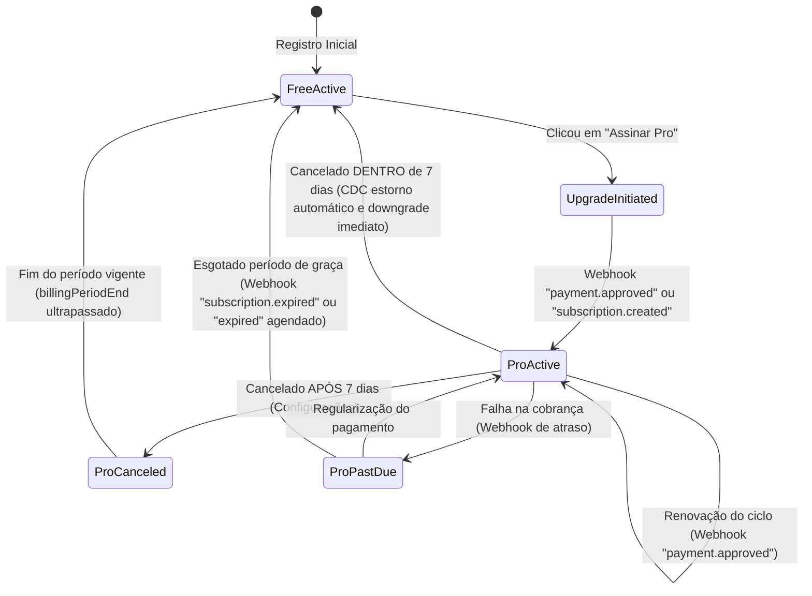

# Data Model: Lançamento Comercial e Assinaturas (Mercado Pago)

**Branch**: `006-billing-subscription` | **Date**: 2026-05-20 | **Spec**: [spec.md](file:///Users/marleite/workspace/pessoal/aprova-flow/specs/006-billing-subscription/spec.md)

Este documento detalha o modelo de dados e as transições de estado para a persistência e controle do ciclo de vida das assinaturas integradas com o Mercado Pago.

---

## 1. Entidades

### Entidade: `user_stats` (Coleção Firestore)
Documento chave com o ID do usuário como ID do documento (`user_stats/{userId}`). Contém o estado de entitlements do usuário.

| Campo | Tipo | Validação | Descrição |
|-------|------|-----------|-----------|
| `planTier` | `'free' \| 'pro'` | Obrigatório | Nível de plano contratado pelo usuário. |
| `subscriptionStatus` | `'active' \| 'canceled' \| 'expired' \| 'trialing' \| 'grace_period' \| 'past_due'` | Obrigatório | Status da recorrência no Mercado Pago. |
| `subscriptionId` | `string` | Opcional | ID da assinatura (`preapproval_id`) no Mercado Pago. |
| `subscriptionPaymentId` | `string` | Opcional | ID da última transação aprovada (`payment_id`), necessária para estornos do CDC. |
| `subscriptionStartedAt` | `string (ISO Date)` | Opcional | Data de início da assinatura/ciclo atual, usada para verificar o prazo de 7 dias do CDC. |
| `billingPeriodEnd` | `string (ISO Date)` | Opcional | Data de encerramento do ciclo contratado atual. |
| `entitlementUsage` | `string (JSON String)` | Obrigatório (default: `'{}'`) | JSON serializado de contadores de uso de cotas do usuário. |
| `entitlementUsagePeriods` | `string (JSON String)` | Obrigatório (default: `'{}'`) | JSON serializado de datas de redefinição de cotas do usuário. |
| `subscriptionUpdatedAt` | `string (ISO Date)` | Obrigatório | Carimbo de data/hora da última sincronização com o gateway. |

### Entidade: `billing_event_logs` (Coleção Firestore)
Documento gerado a cada processamento de webhook ou alteração administrativa, servindo para auditoria financeira e conciliação de eventos.

| Campo | Tipo | Validação | Descrição |
|-------|------|-----------|-----------|
| `id` | `string` | Obrigatório | UUID ou ID do evento fornecido pelo Mercado Pago. |
| `userId` | `string` | Obrigatório | ID do usuário no AprovaMind. |
| `provider` | `'mercadopago'` | Obrigatório | Provedor do faturamento. |
| `eventType` | `string` | Obrigatório | Tipo do evento recebido (ex: `subscription.created`, `payment.approved`, `subscription.canceled`, `payment.refunded`). |
| `payload` | `string (JSON String)` | Obrigatório | Payload bruto recebido do gateway de pagamento para auditorias futuras. |
| `processedAt` | `string (ISO Date)` | Obrigatório | Data em que o webhook foi processado. |

---

## 2. Transições de Estado de Assinatura

O ciclo de vida da assinatura segue o fluxo descrito na máquina de estados abaixo:

### Regras de Transição e Validação de Negócio

1. **Garantia de Não-Fidelidade pós-7 dias (Cancelamento Tradicional)**:
   - **Gatilho**: Usuário clica em "Cancelar Assinatura" ou cancelamento via painel.
   - **Condição**: Transcorridos > 7 dias desde `subscriptionStartedAt`.
   - **Ação**: O `subscriptionStatus` é atualizado para `canceled`. O `planTier` **permanece** `pro`.
   - **Exclusão**: O acesso Pro só é efetivamente removido (retornando a `free`) quando a data atual ultrapassar `billingPeriodEnd`.

2. **Direito de Arrependimento de 7 dias (CDC)**:
   - **Gatilho**: Cancelamento solicitado pelo usuário.
   - **Condição**: Data atual menor ou igual a `subscriptionStartedAt + 7 dias`.
   - **Ação**:
     1. API efetua requisição de estorno automático no Mercado Pago usando `subscriptionPaymentId`.
     2. Assinatura é imediatamente desativada no Mercado Pago.
     3. No Firestore, `planTier` é imediatamente alterado para `free`, `subscriptionStatus` vira `expired`, e as cotas retornam para o padrão Free.

3. **Validação de Webhooks (Fraude e Re-execução)**:
   - O `id` do evento do Mercado Pago é persistido em `billing_event_logs` antes de rodar a transição.
   - Se o `id` de evento já existir na coleção `billing_event_logs`, o processamento é considerado duplicado e interrompido imediatamente com resposta de sucesso (Idempotência), evitando sobreposição indesejada ou resets de cotas concorrentes.
